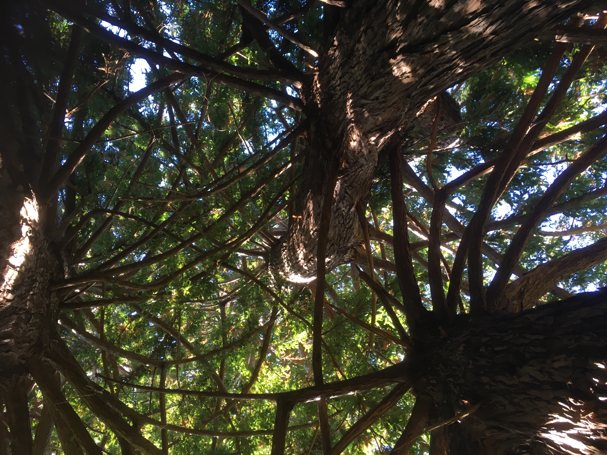
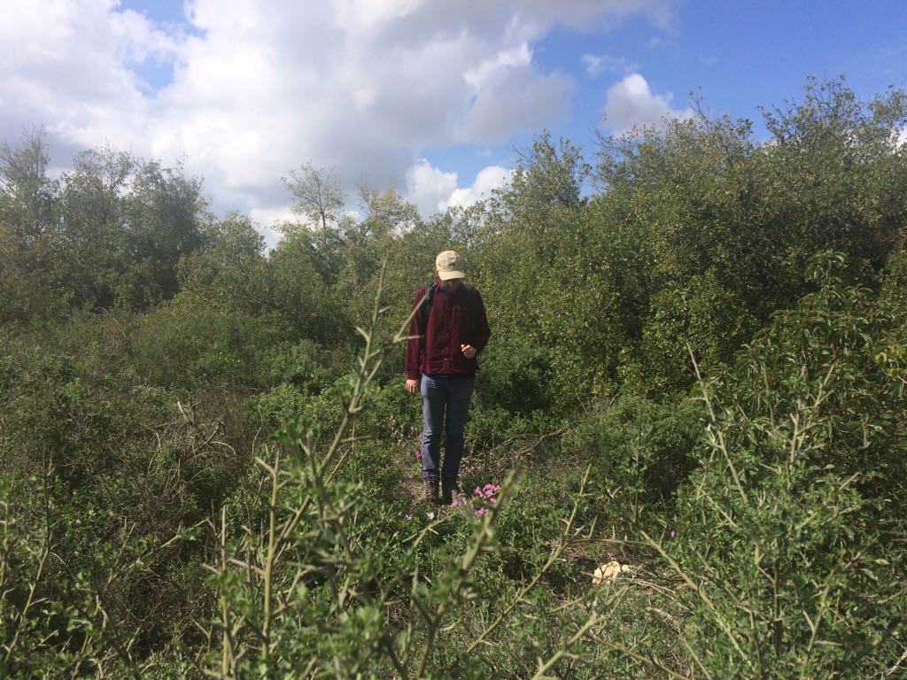

# Hello! Welcome to the personal website of Roí A.K.



*Redwood in Santa Cruz, CA*


*Maple-Pine marsh edge, MA*


*Maple, ash, and beech dominated wood, VT*

## About me

I'm a forest ecologist from Jerusalem interested in how the interactions between different tree architectures impact ecosystem function.




*Finding Cyclamen persicum in the Jerusalem mountains*


*Pistacia palaestina and Quercus calliprinos dominated forest in Jerusalem mountains*

## My Research
I'm currently a graduate student at Columbia University in Dr. María Uriarte's lab studying how canopy structure changes wind and hurricane damage in forests across Puerto Rico.


*Drawing by Nina Berinstein*


*Light ranging and detection (LiDAR) x-y-z point cloud quantifying canopy structure*

### Code test

**Testing out a code block**
```python
#function test of tree under different conditions
def trees(action):
  if action == "hurricane": #during a hurricane
    print("better be bendable") #the tree must have high elastic modulus
  elif action == "drought": #during a drought
    print("better be less dense") #water conductivity needs to be efficient
  elif action == "baseline": #when not undergoing disturbance 
    print("better be shade-tolerant") #neighborhood dynamics dictate composition
  else:
    print("sorry, this tree is no longer available") #otherwise print generic message
  
```

*Testing out function*
```python
#test out this code
trees("hurricane")
```

```python
better be bendable
```
